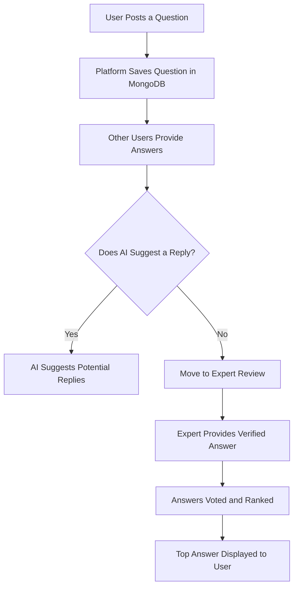
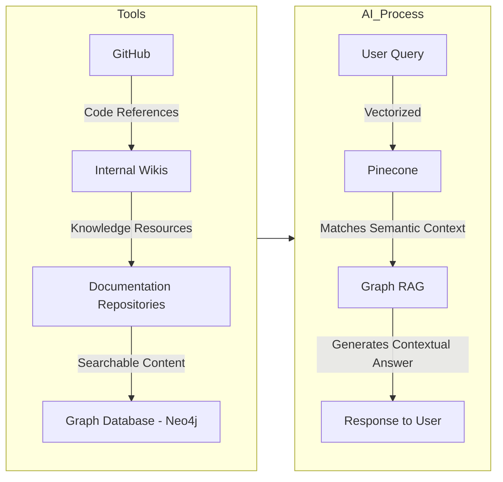
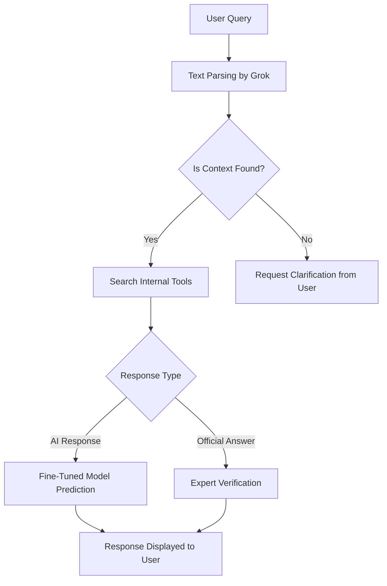
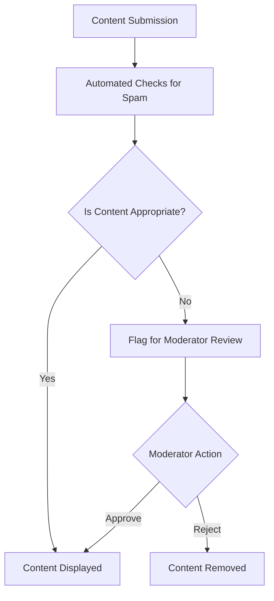
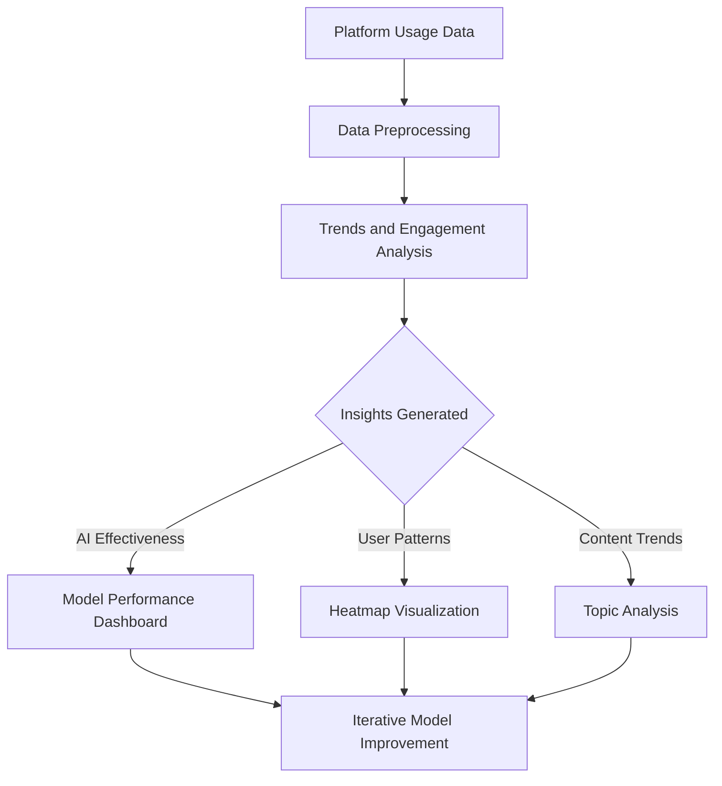

# **The Ultimate Q&A Platform for Seamless Employee Collaboration**

In the evolving landscape of organizational efficiency, 🌟 the seamless integration of information flow and employee collaboration remains paramount. Our Q&A platform redefines this paradigm by leveraging internal resources such as 📖 Wikipedia, 🖥️ GitHub repositories, 🗃️ wikis, and 📝 organizational documents, augmented by cutting-edge AI methodologies. This platform is not merely a tool but a transformative ecosystem designed to foster a culture of shared knowledge and operational excellence.

---

## **The Core of Integration: Exploiting Internal Tools**

Our platform operates as the nexus of organizational knowledge, seamlessly incorporating a variety of internal resources:

- 📚 **Wikipedia and Wikis:** Providing real-time access to both internal and external knowledge repositories ensures employees are equipped with up-to-date, comprehensive information.
- 🛠️ **GitHub Repositories:** Integration enables direct referencing of codebases, workflows, and collaborative technical data, streamlining development discussions.
- 📂 **Document Management Systems:** Facilitating the retrieval and management of mission-critical documentation for context-specific queries.

This synergy ensures the platform transcends conventional knowledge-sharing tools, providing an integrative approach to problem-solving and innovation.

---

## **Architectural Framework: Technical Exposition**

### **Graph RAG (Retrieval-Augmented Generation)**

Graph RAG is the cornerstone of our platform, enhancing data processing and knowledge dissemination:

- 🔍 **Efficient Data Retrieval:** Extracting relevant data from extensive repositories to curate precise informational snippets.
- 🌐 **Graph Mapping:** Employing Neo4j to construct a relational knowledge graph, elucidating connections between disparate data points.
- 🤖 **Contextualized Responses:** Leveraging structured datasets to refine AI-generated answers with unparalleled relevance and accuracy.

### **Neo4j: Pioneering Knowledge Graphs**

Neo4j serves as the backbone for graph-based relational data storage:

- 🗂️ **Dynamic Data Structures:** Mapping queries, responses, tags, and contributors to establish a robust relational framework.
- 🔗 **Enhanced Discovery:** Enabling advanced querying capabilities through visualized interrelationships.
- 🕒 **Real-Time Adaptability:** Accommodating the fluid nature of enterprise knowledge.

### **Pinecone: Semantic Vectorization**

Pinecone underpins the platform’s sophisticated semantic search functionalities:

- 🔎 **Vector Embedding:** Translating queries into vector spaces for accurate semantic matching.
- ⚡ **Accelerated Retrieval:** Optimizing search operations across expansive datasets.
- 📈 **Adaptive Learning:** Continuously evolving through iterative updates and user interaction.

### **Grok: Parsing for Precision**

Grok facilitates the ingestion of textual and structured data from internal documents:

- 📖 **Content Extraction:** Parsing documents to identify relevant knowledge snippets.
- 🧠 **AI Model Training:** Enhancing model contextuality through curated datasets.
- ✅ **Ambiguity Mitigation:** Increasing response precision by refining data inputs.

### **Data Infrastructure**

- 🗄️ **MongoDB:** Providing a scalable and flexible schema for storing user interactions, including questions, responses, and voting data.
- 🔧 **Backend Systems:** Node.js and Django orchestrate the backend architecture, supporting real-time interactions and machine learning workflows.

---

## **Elevating Conventional Features**

### **1. Personalized User Profiles**
Each user’s profile showcases their contributions, areas of expertise, and engagement levels. 🧑‍💻👩‍💻

### **2. Streamlined Question Categorization**
Advanced tagging and categorization ensure efficient navigation and thematic discussions. 🏷️

### **3. AI-Driven Responses**
Fine-tuned models, including 🤖 BERT and 🦙 LLaMA, deliver contextualized responses, distinctly labeled to differentiate from human-generated content.

### **4. Dynamic Voting Mechanism**
A robust algorithm prioritizes high-quality answers, ensuring that the most useful content is prominently displayed. ⬆️⬇️

### **5. Verified Expert Responses**
Official answers from domain experts are distinctly marked, lending credibility and clarity. 🏅

### **6. Moderation Protocols**
A dual-layered approach of automated checks and manual oversight ensures the quality and relevance of shared content. 🚦

### **7. Real-Time Notifications**
Users receive instant updates about question activity and related topics, ensuring engagement. 🔔

### **8. Comprehensive Analytics**
A dedicated dashboard offers insights into user engagement, platform trends, and improvement areas. 📊📈

---

## **Mermaid Diagrams: Strategic Visualization**

### **1. Platform Workflow Overview**

### **2. Internal Tool Integration**

### **3. AI Response Lifecycle**

### **4. Moderation Workflow**

### **5. Analytics Dashboard Architecture**

---

## **Unparalleled Value Proposition**

### **1. Integrated Knowledge Ecosystem**
A harmonized repository bridging institutional expertise and modern tools. 🌉

### **2. AI-Augmented Efficiency**
State-of-the-art 🤖 BERT and 🦙 LLaMA models enable accurate, context-driven knowledge dissemination.

### **3. User-Centric Design**
Features designed to enhance accessibility, engagement, and satisfaction. 💡

### **4. Quality Assurance**
A rigorous moderation system ensures the highest standards of content accuracy and appropriateness. ✅🛡️

---

## **Conclusion**
Our Q&A platform epitomizes innovation and collaborative potential. By amalgamating advanced AI, robust tool integrations, and user-focused functionalities, this system transcends traditional knowledge-sharing paradigms, fostering a collaborative and growth-oriented organizational culture. Join us in redefining workplace collaboration. 🌟✨🚀

